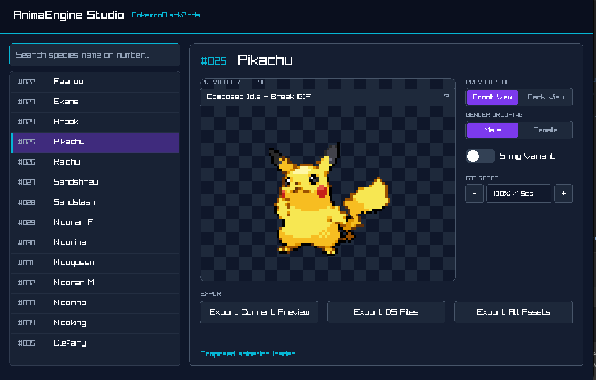
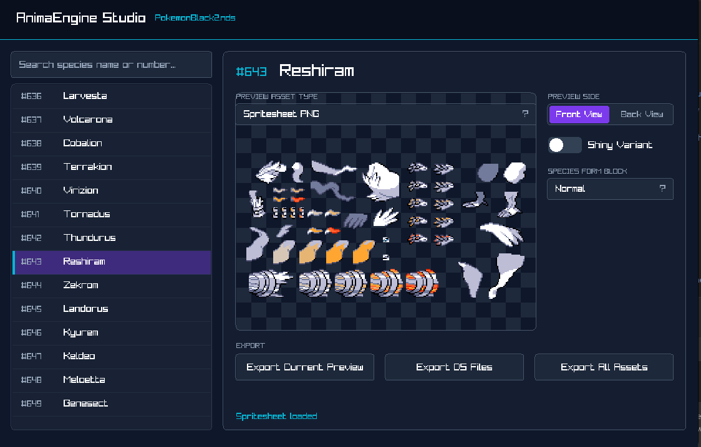
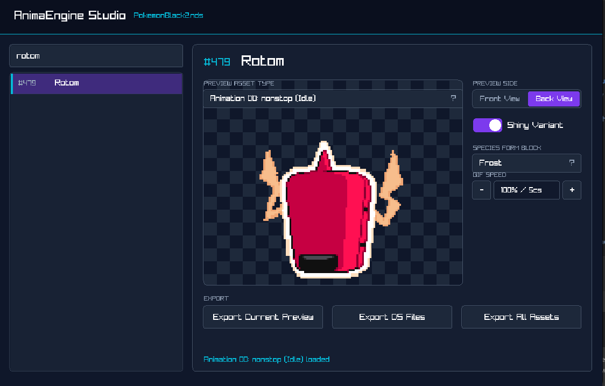

# AnimaEngine

AnimaEngine is a C99 sprite extraction and preview toolchain for Nintendo DS
Pokemon Black and White battle graphics. It reads the Pokegra archive
(`/a/0/0/4`), decodes Nitro graphics formats, reconstructs multi-part battle
sprites, and exports PNG previews, animated idle GIFs, idle break GIFs,
composed idle-to-break GIFs, and reconstruction JSON.

No ROMs, save files, extracted Pokemon assets, or Nintendo copyrighted data are
included in this repository or in release packages. You must provide your own
legally dumped `.nds` ROM.

## Screenshots







## Features

- GUI browser with live previews, Pokemon search, side/gender/shiny/form
  controls, animation speed control, and per-asset export.
- CLI extraction for automated workflows.
- Nitro parsers for NCGR, NCLR, NCER, NANR, NMCR, and NMAR.
- Separate idle, idle break, composed, spritesheet, static PNG, NDS file, raw
  member, and reconstruction JSON outputs.
- Canonical full-export folder layout:

  ```text
  out/pokedexNNN_PokemonName/
    raw_narc_members/
    nds_files/
    reconstruction_json/
    spritesheet_png/
    static_png/
    animated_idle_gif/
    idle_break_gif/
    composed_gif/
  ```

## Downloading A Release

Tagged GitHub Releases provide precompiled GUI packages for Linux, Windows, and
macOS. These packages bundle the raylib runtime where needed, so users do not
need to install raylib just to run the GUI.

- Linux: extract `AnimaEngine-*-linux-x86_64.tar.gz` and run `./run-gui.sh`.
- Windows: extract `AnimaEngine-*-windows-x86_64.zip` and run
  `AnimaEngineGUI.exe`.
- macOS: extract the archive and run `./run-gui.command`. The binaries are not
  codesigned yet, so macOS may require right-clicking and choosing Open.

## Build Requirements

- C99 compiler: GCC or Clang
- `make`
- `pkg-config`
- `libpng`
- `raylib` for GUI builds only
- `doxygen` for generated API docs

On Debian/Ubuntu for local development:

```bash
sudo apt install build-essential make pkg-config libpng-dev doxygen
```

Install raylib through your package manager or from source before building the
GUI locally.

## Building

```bash
make        # builds ./AnimaEngine
make gui    # builds ./AnimaEngineGUI
make docs   # generates docs/html with Doxygen
make clean  # removes local binaries and object files
```

## GUI Usage

```bash
./AnimaEngineGUI
```

Load a Pokemon Black or White `.nds` ROM, choose a species, select the preview
asset, and export the current preview, the species DS files, or all assets.

## CLI Usage

Full export mode writes to a canonical species folder below the output root:

```bash
./AnimaEngine PokemonWhite.nds 7 out --gif-side both --gif-palette normal --gif-break --gif-composed
```

That command writes Squirtle assets under:

```text
out/pokedex007_Squirtle/
```

Single asset export mode writes exactly to the requested output path:

```bash
./AnimaEngine PokemonWhite.nds 25 out/pikachu_idle.gif --mode single --asset idle
./AnimaEngine PokemonWhite.nds 25 out/pikachu_sheet.png --mode single --asset spritesheet
```

Run the built-in help for all options:

```bash
./AnimaEngine --help
```

## Release Builds

The workflow in `.github/workflows/release.yml` builds Linux, Windows, and
macOS packages and attaches them to a GitHub Release when a tag like `v1.0.0` is
pushed.

See [docs/RELEASE.md](docs/RELEASE.md) for the release checklist.

## Documentation

API documentation is generated with:

```bash
make docs
```

Open `docs/html/index.html` after generation.

## License

AnimaEngine code is released under the MIT License. See [LICENSE](LICENSE).
Third-party runtime notices are listed in
[THIRD_PARTY_NOTICES.md](THIRD_PARTY_NOTICES.md).
