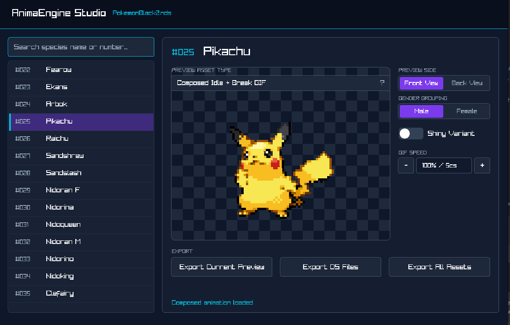
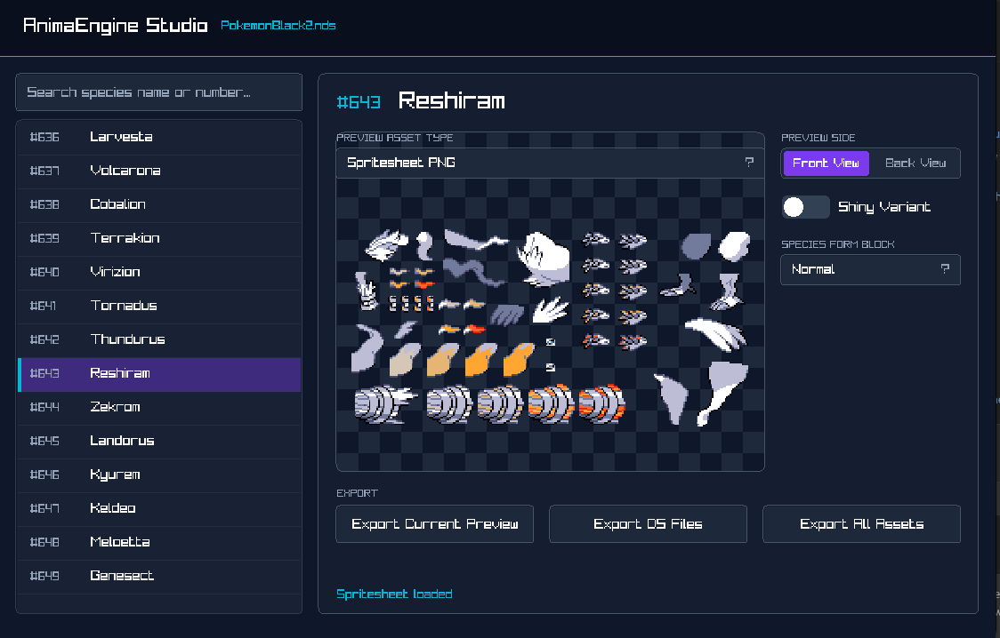
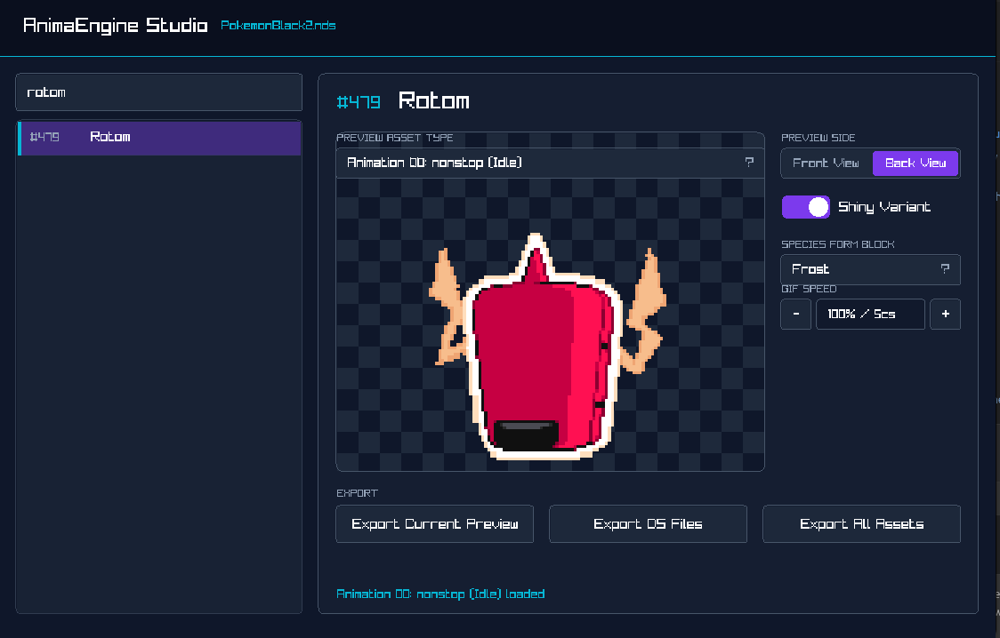

# AnimaEngine

[](LICENSE)
[](https://github.com/KillDaWill/AnimaEngine/releases/latest)
[](.github/workflows/ci.yml)
[](https://killdawill.github.io/AnimaEngine/)

AnimaEngine is a C99 sprite extraction and preview toolchain for Nintendo DS
Pokemon Black, White, Black 2, and White 2 battle graphics. It works with the
original Gen V games and their sequels by reading the Pokegra archive
(`/a/0/0/4`), decoding Nitro graphics formats, reconstructing multi-part battle
sprites, and exporting PNG previews, animated idle GIFs, idle break GIFs,
composed idle-to-break GIFs, and reconstruction JSON.

No ROMs, save files, extracted Pokemon assets, or Nintendo copyrighted data are
included in this repository or in release packages. You must provide your own
legally dumped `.nds` ROM. Pokémon and individual species names are trademarks
of Nintendo, Game Freak, and Creatures Inc.; see
[THIRD_PARTY_NOTICES.md](THIRD_PARTY_NOTICES.md) for the full trademark
disclaimer.

## Screenshots







## Features

- GUI browser with live previews, Pokemon search, side/gender/shiny/form
  controls, animation speed control, and per-asset export.
- CLI extraction for automated workflows.
- Nitro parsers for NCGR, NCLR, NCER, NANR, NMCR, and NMAR.
- Separate idle, idle break, composed, spritesheet, static PNG, NDS file, raw
  member, and reconstruction JSON outputs.
- Canonical full-export folder layout:

  ```text
  out/pokedexNNN_PokemonName/
    raw_narc_members/
    nds_files/
    reconstruction_json/
    spritesheet_png/
    static_png/
    animated_idle_gif/
    idle_break_gif/
    composed_gif/
  ```

## How it works

The pipeline is built from small, single-responsibility C modules so each stage
is easy to test and reason about end to end:

1. **ROM mount** — `nds_header`, `nds_fat`, and `nds_fnt` parse the Nintendo
   DS cartridge header, the File Allocation Table, and the File Name Table to
   give a path-addressable filesystem over the `.nds` blob.
2. **Archive extraction** — `narc` reads the Pokegra archive at `/a/0/0/4`
   into individual members (NCGR, NCLR, NCER, NANR, NMCR, NMAR).
3. **Format decoding** — Each Nitro format has its own parser:
   `ncgr` decodes tile graphics, `nclr` decodes palettes, `ncer` decodes
   sprite cells, `nanr` decodes frame animations, and `nmcr` / `nmar` decode
   multi-cell / multi-animation banks.
4. **Decompression** — `lz` transparently handles LZ10 and LZ11 streams that
   wrap NARC members in many DS titles.
5. **Composition** — `sprite_composer` lays the multi-part battle sprite down
   on a canvas, applying per-cell offsets, palette indices, and animation
   state.
6. **Export** — `png_writer` and `gif_writer` write the result. `gif_pipeline`
   and `png_pipeline` wrap the writers to produce spritesheets, animated idle
   GIFs, idle-break GIFs, composed GIFs, and static PNGs. `json_export` emits
   reconstruction metadata so a downstream tool can reproduce the export.
7. **GUI** — The raylib-based GUI (`gui_*`) provides live preview, search,
   side/gender/shiny/form controls, and per-asset export on top of the same
   backend (`anima_backend`) used by the CLI.

The CLI and GUI share the same `source/anima_backend.c` entry point, so
behaviour is identical between them.

## Downloading a release

Tagged GitHub Releases provide precompiled GUI packages for Linux, Windows,
and macOS (Apple Silicon and Intel). These packages bundle the raylib runtime
where needed, so users do not need to install raylib just to run the GUI.

- Linux: extract `AnimaEngine-*-linux-x86_64.tar.gz` and run `./run-gui.sh`.
- Windows: extract `AnimaEngine-*-windows-x86_64.zip` and run
  `AnimaEngineGUI.exe`.
- macOS (Apple Silicon): extract `AnimaEngine-*-macos-arm64.tar.gz` and run
  `./run-gui.command`.
- macOS (Intel): extract `AnimaEngine-*-macos-x86_64.tar.gz` and run
  `./run-gui.command`. The binaries are not codesigned yet, so macOS may
  require right-clicking and choosing Open.

## Build Requirements

- C99 compiler: GCC or Clang
- `make`
- `pkg-config`
- `libpng`
- `raylib` for GUI builds only
- `doxygen` for generated API docs

On Debian/Ubuntu for local development:

```bash
sudo apt install build-essential make pkg-config libpng-dev doxygen
```

Install raylib through your package manager or from source before building the
GUI locally.

## Building

```bash
make        # builds ./AnimaEngine
make gui    # builds ./AnimaEngineGUI
make test   # builds and runs the unit tests
make docs   # generates Doxygen output under docs/build
make clean  # removes local binaries and object files
```

## GUI Usage

```bash
./AnimaEngineGUI
```

Load a Pokemon Black, White, Black 2, or White 2 `.nds` ROM, choose a species,
select the preview asset, and export the current preview, the species DS files,
or all assets.

## CLI Usage

Full export mode writes to a canonical species folder below the output root:

```bash
./AnimaEngine PokemonWhite.nds 7 out --gif-side both --gif-palette normal --gif-break --gif-composed
# Sequels are supported too:
./AnimaEngine PokemonBlack2.nds 7 out --gif-side both --gif-palette normal --gif-break --gif-composed
```

That command writes Squirtle assets under:

```text
out/pokedex007_Squirtle/
```

Single asset export mode writes exactly to the requested output path:

```bash
./AnimaEngine PokemonWhite.nds 25 out/pikachu_idle.gif --mode single --asset idle
./AnimaEngine PokemonWhite.nds 25 out/pikachu_sheet.png --mode single --asset spritesheet
```

Note: in `--mode single` the third positional argument is the destination
file path; in default (full) mode it is a directory. Use `--mode` explicitly
when in doubt.

Run the built-in help for all options:

```bash
./AnimaEngine --help
```

## Documentation

The latest published API reference lives at
<https://killdawill.github.io/AnimaEngine/> (built automatically from
`main` by the docs workflow).

To generate the docs locally:

```bash
make docs
```

Open `docs/build/html/index.html` after generation.

## License

AnimaEngine code is released under the MIT License. See [LICENSE](LICENSE).
Third-party runtime and trademark notices are listed in
[THIRD_PARTY_NOTICES.md](THIRD_PARTY_NOTICES.md).

## Contributing

Issues and pull requests are welcome. For anything that touches sprite
reconstruction or format decoding, please attach a small reproducer (a hex
dump of the NARC member and the expected output is enough) so the change can
be verified. See [CHANGELOG.md](CHANGELOG.md) for the release history.
